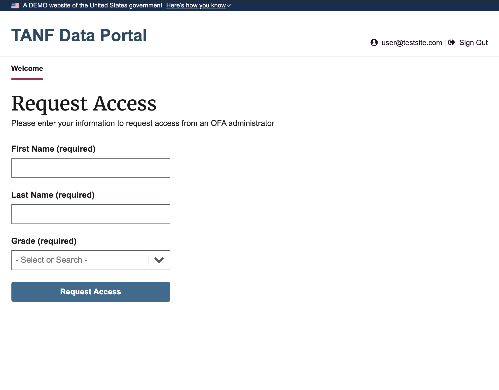

# TANF Data Portal USWDS ReactJS Exercise

An accessible frontend web application built using ReactJS that utilizes the United States Web Design System [USWDS](https://designsystem.digital.gov/).




## Requirements

* **Create Page** - Re-create the page shown.
* **Three Fields** - The page should have three fields: First Name (Reqd.), Last Name (Reqd.), and Grade (Reqd.). Grade will be a drop down with values `1` to `10`.
* **Button** - The page should have a "Submit" button. When the required fields are present, the button will output the data in the three fields to console.
* **Accessibility** - The page should have no accessibility errors based on AA WCAG standards.
* **JS Errors** - The page should have no JS errors.

## Prerequisites

- [Docker](https://docs.docker.com/docker-for-mac/install/)
- [NodeJS](https://nodejs.org/en/download/)
- [Yarn Package Manager](https://classic.yarnpkg.com/en/docs/install/#mac-stable)

## Contents

- [Local Setup and Usage](#Local-Setup-and-Usage)
- [Unit and Integration Testing](#Unit-and-Integration-Testing)


### Local Setup and Usage

_Note: The latest Docker Desktop is required to already be installed on your system._

1. Make sure Docker is already running, then from the `frontend/` directory run:

```
docker-compose up
```

2. Once the container is built and running, open `http://localhost:5000`in your browser to view the app.

A more comprehensive documented overview of the app and tests with screenshots can be found [here](docs/overview.md).


### Unit and Integration Testing

This project uses [Jest](https://jestjs.io/) for unit tests and integration tests.

1. To run the unit tests locally use:

```
yarn test
```
Press Control + C to quit once done running tests.


2. To run the tests with **code coverage** use:

```
yarn test:cov
```
Press Control + C to quit once done running tests.


3. To run the tests as a **continous integration** environment use:

```
yarn test:ci
```

After running either the _code coverage_ or _continous integration_ tests, the coverage details can be easily viewed in your web browser by running from the **frontend** directory:

```
open coverage/lcov-report/index.html
```


## Changelog

**v.0.1.0**
- Initial release
