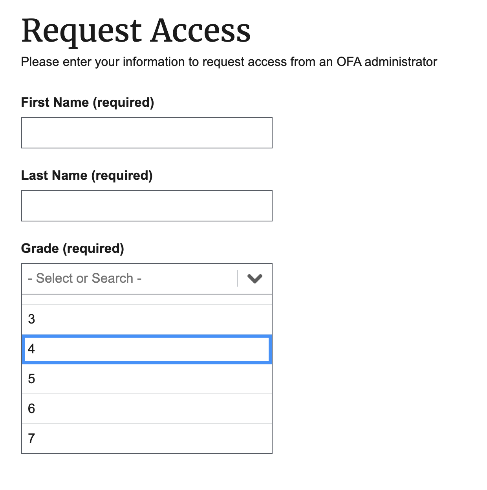
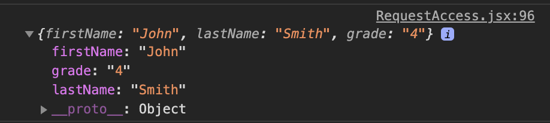
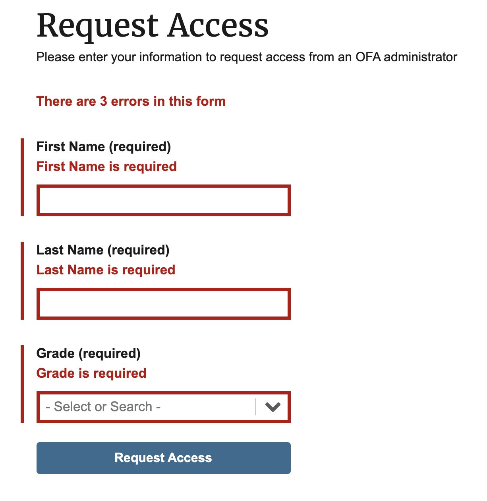
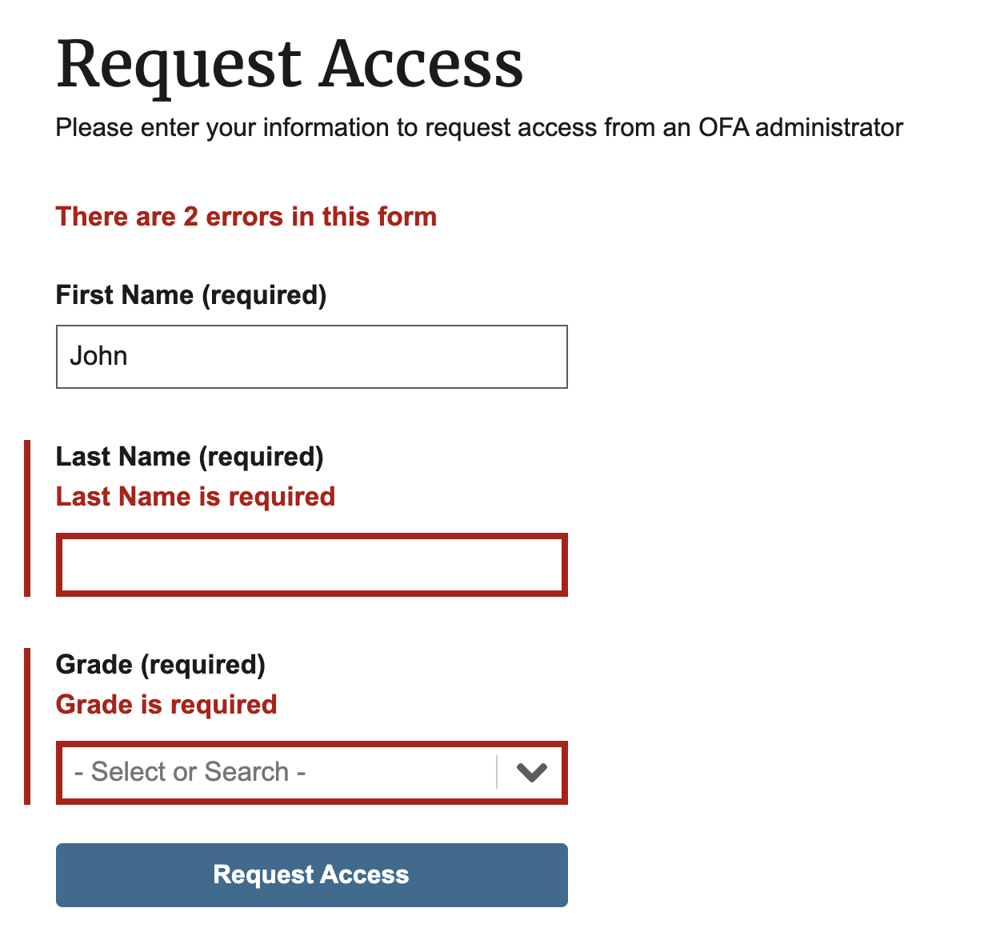
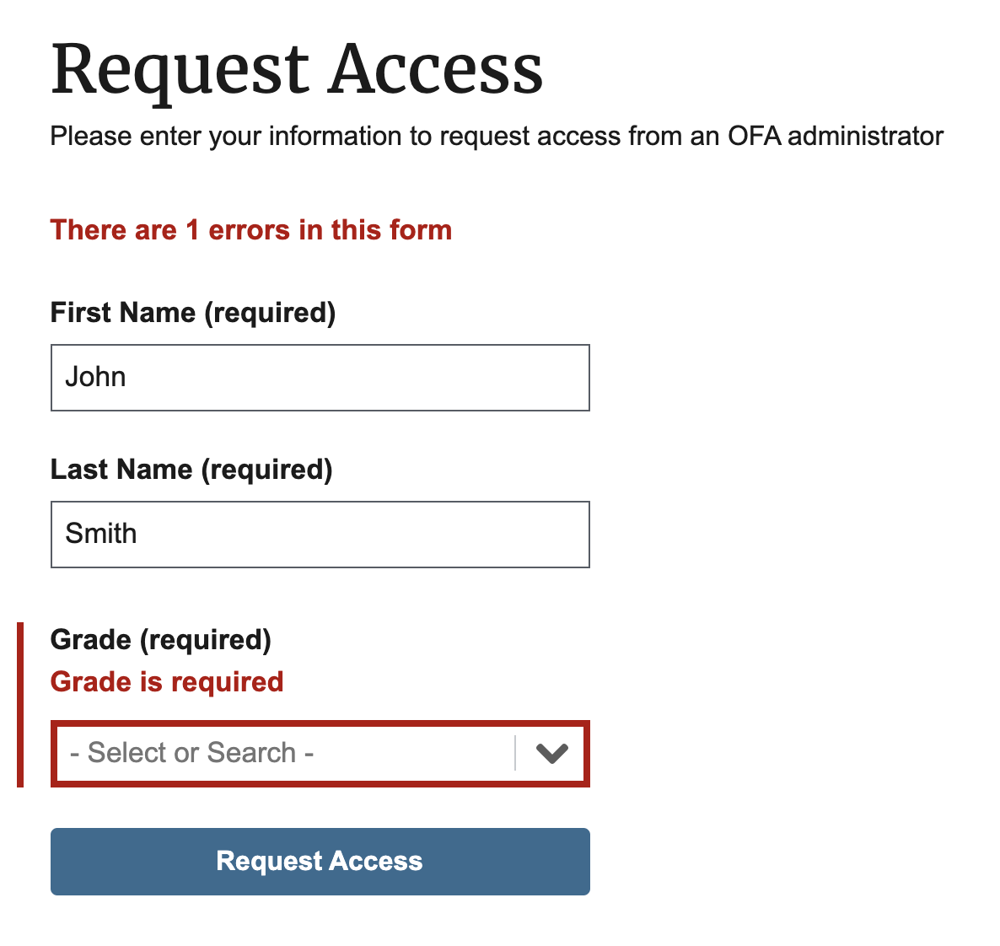
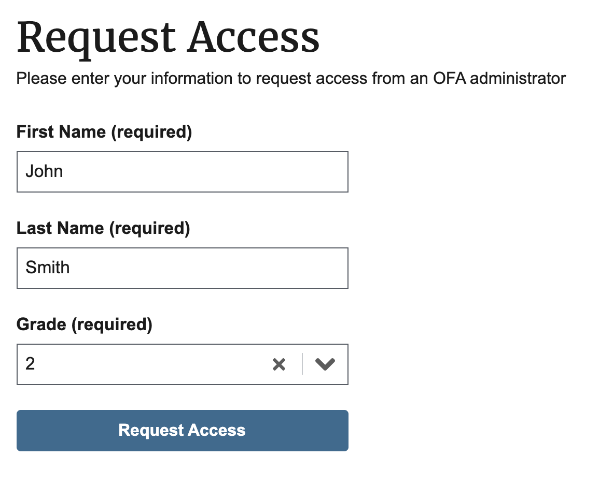
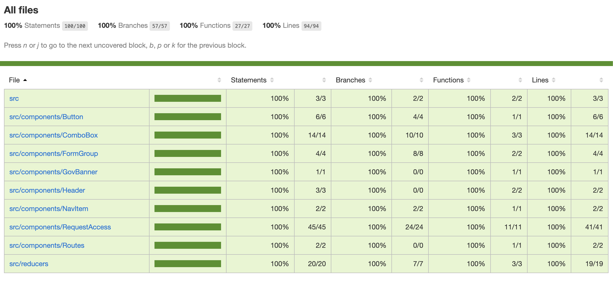
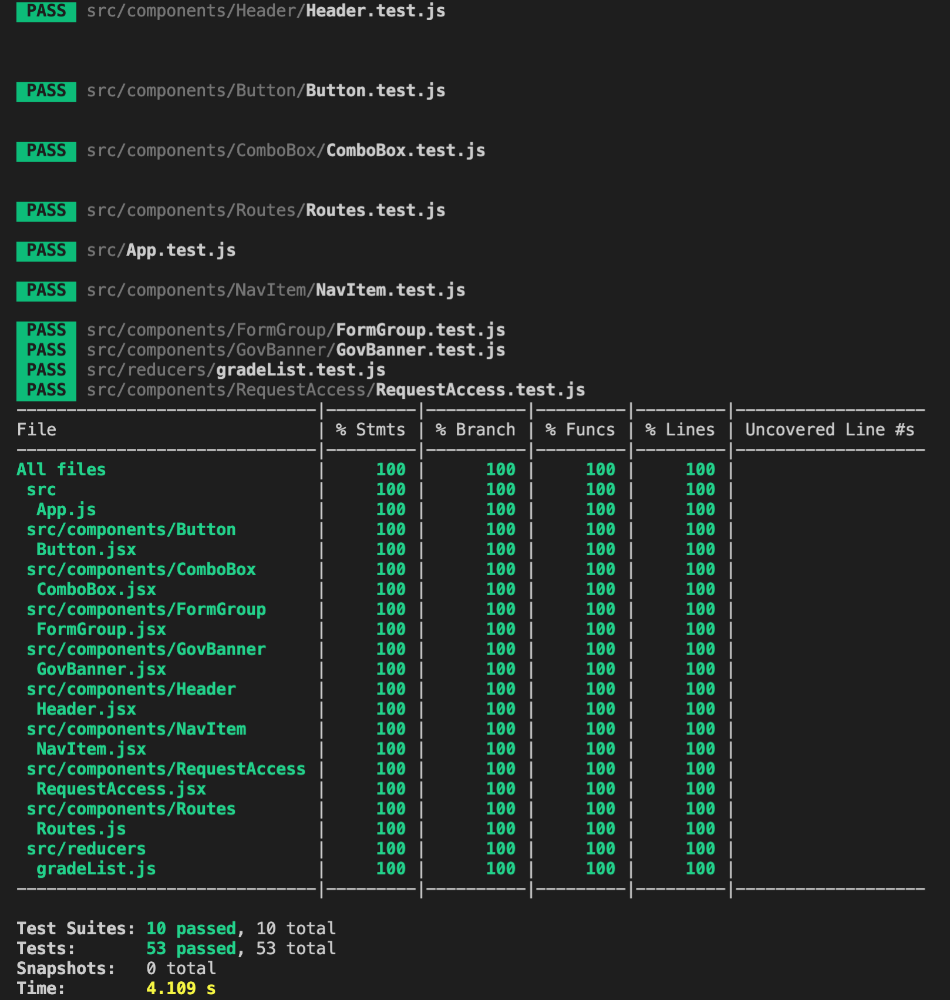
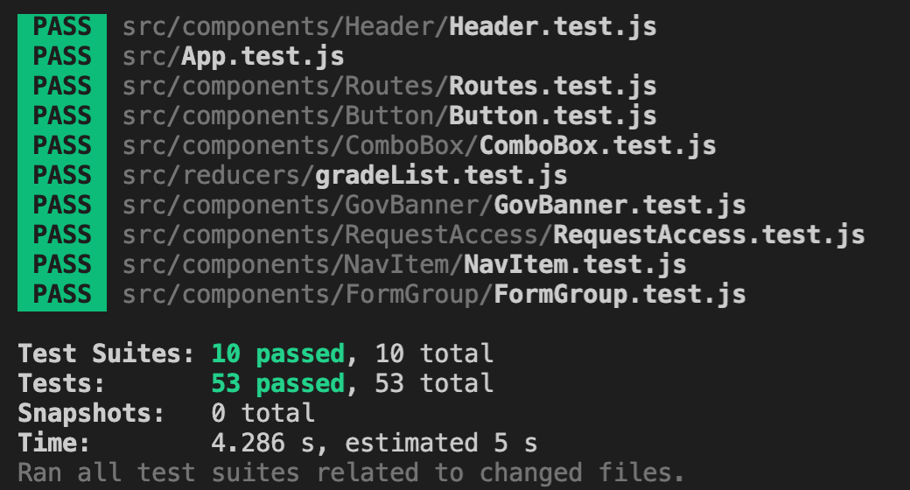

# Overview of TANF Data Portal USWDS ReactJS Exercise (RAFT)

This document will provide a quick overview of the project with screenshots.

## Main App

This is the main application with the design that matches the [screenshot](https://i.snipboard.io/qwsQz9.jpg) referenced in the exercise requirements based on the USWDS.

The contents of the grade dropdown list shows values `1` to `10` as required by the code exercise.

Open the console window and click on the **Request Access** button will show the values of the three input fields made by the user as required in the exercise. This could just as easily have been sent to a backend API as a JSON payload.

### Errors

Starting with no valid inputs, we see three errors.

After filling in one input field, the errors are reduced to two.

After filling in two input fields, the errors are reduced to one.

Finally, after filling in all three input fields, there are no more errors.

### Test Coverage

The graphical ui version of the code coverage after running `yarn test:cov`.

The command line version of the coverage tests.

The results of the tests after running `yarn test`.

